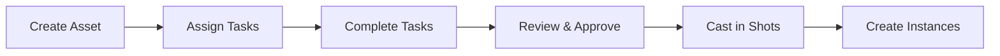

## Introduction

The Assets API provides endpoints for managing production assets in your animation or VFX project. Assets are reusable entities that can be referenced across multiple shots, sequences, or episodes. Common asset types include characters, props, environments, vehicles, and FX elements.

## What are Assets?

In Zou/Kitsu, an **Asset** is a specialized type of Entity that represents a reusable production element. Assets differ from temporal entities (shots, sequences, episodes) and are categorized by Asset Types.

### Key Concepts

<CardGroup cols={2}>
  <Card title="Asset Types" icon="tag">
    Categories that classify assets (Character, Prop, Environment, Vehicle, FX, etc.)
  </Card>
  <Card title="Asset Instances" icon="clone">
    Specific occurrences of an asset in a shot or scene with unique properties
  </Card>
  <Card title="Casting" icon="users">
    Relationships showing which assets appear in which shots
  </Card>
  <Card title="Shared Assets" icon="share-nodes">
    Assets that can be reused across multiple projects
  </Card>
</CardGroup>

## Asset Model

Assets inherit from the Entity model and include the following key properties:

<ResponseField name="id" type="string" required>
  Unique identifier (UUID format)
</ResponseField>

<ResponseField name="name" type="string" required>
  Asset name (e.g., "Hero Character", "Magic Sword")
</ResponseField>

<ResponseField name="description" type="string">
  Detailed description of the asset
</ResponseField>

<ResponseField name="project_id" type="string" required>
  ID of the project this asset belongs to
</ResponseField>

<ResponseField name="entity_type_id" type="string" required>
  ID of the asset type (Character, Prop, etc.)
</ResponseField>

<ResponseField name="preview_file_id" type="string">
  ID of the main preview/thumbnail image
</ResponseField>

<ResponseField name="data" type="object">
  Custom metadata and descriptor fields (JSONB)
</ResponseField>

<ResponseField name="canceled" type="boolean">
  Whether the asset has been canceled
</ResponseField>

<ResponseField name="is_shared" type="boolean">
  Whether the asset can be used in other projects
</ResponseField>

<ResponseField name="source_id" type="string">
  Episode ID if this is an episodic asset variant
</ResponseField>

<ResponseField name="ready_for" type="string">
  Task type ID indicating production readiness
</ResponseField>

<ResponseField name="created_by" type="string">
  ID of the user who created the asset
</ResponseField>

<ResponseField name="created_at" type="string">
  Creation timestamp (ISO 8601 format)
</ResponseField>

<ResponseField name="updated_at" type="string">
  Last update timestamp (ISO 8601 format)
</ResponseField>

## Asset Types

Asset Types are categories used to organize and classify assets. They help structure your production pipeline by grouping similar assets together.

### Common Asset Types

- **Character**: Main and supporting characters
- **Prop**: Objects that characters interact with
- **Environment**: Sets, locations, and backgrounds
- **Vehicle**: Cars, ships, aircraft, etc.
- **FX**: Effects elements (fire, water, magic)
- **Camera**: Virtual cameras
- **Light**: Lighting setups

### Asset Type Model

<ResponseField name="id" type="string" required>
  Unique identifier for the asset type
</ResponseField>

<ResponseField name="name" type="string" required>
  Asset type name (e.g., "Character", "Prop")
</ResponseField>

<ResponseField name="short_name" type="string">
  Abbreviated name for UI display
</ResponseField>

<ResponseField name="description" type="string">
  Description of the asset type
</ResponseField>

<ResponseField name="task_types" type="array">
  Task types associated with this asset type
</ResponseField>

<ResponseField name="archived" type="boolean">
  Whether the asset type is archived
</ResponseField>

## Asset Instances

Asset Instances represent specific occurrences of an asset within a shot, scene, or even another asset. This is useful for complex scenes where the same asset appears multiple times with different properties.

### Use Cases

- **Multiple occurrences**: 10 swords in a battle scene
- **Variations**: Same character with different costumes
- **Shot-specific**: Asset with unique animation or position data per shot
- **Nested assets**: Props inside environment assets

### Asset Instance Model

<ResponseField name="id" type="string" required>
  Unique identifier for the instance
</ResponseField>

<ResponseField name="asset_id" type="string" required>
  ID of the parent asset (shot/scene/asset containing this instance)
</ResponseField>

<ResponseField name="target_asset_id" type="string" required>
  ID of the asset being instantiated
</ResponseField>

<ResponseField name="scene_id" type="string">
  ID of the scene (if applicable)
</ResponseField>

<ResponseField name="number" type="integer">
  Instance number for ordering (001, 002, etc.)
</ResponseField>

<ResponseField name="name" type="string">
  Optional name for this instance
</ResponseField>

<ResponseField name="description" type="string">
  Description or notes about this instance
</ResponseField>

<ResponseField name="active" type="boolean">
  Whether this instance is active
</ResponseField>

<ResponseField name="data" type="object">
  Custom data specific to this instance
</ResponseField>

## Casting

Casting defines the relationship between assets and shots/sequences. When an asset is "cast" in a shot, it means that asset appears or is used in that shot.

### Casting Operations

- **Get Casting**: See which assets are used in a shot
- **Update Casting**: Add or remove assets from a shot
- **Get Cast In**: Find all shots that use a specific asset

## Shared Assets

Shared assets are assets that can be reused across multiple projects. This is useful for:

- Library assets (generic props, environments)
- Brand assets (logos, standard elements)
- Cross-project characters

### Sharing Operations

- Share/unshare assets by project
- Share/unshare assets by asset type
- Share/unshare specific asset lists
- Find shared assets used in a project

## Common Workflows

### Creating an Asset

1. Choose or create an Asset Type
2. Create the asset with name and metadata
3. Add tasks (modeling, texturing, rigging, etc.)
4. Upload preview images
5. Mark as ready when complete

### Asset Production Pipeline

### Using Assets in Shots

1. Cast the asset in the shot (add to breakdown)
2. Create asset instances if multiple occurrences needed
3. Track asset-specific shot tasks
4. Reference asset files in shot production

## Filtering and Querying

Most asset endpoints support filtering by:

- **project_id**: Filter by project
- **asset_type_id**: Filter by asset type
- **episode_id**: Filter episodic assets
- **assigned_to**: Filter by assigned team member
- **page/limit**: Pagination controls

## Permissions

Asset operations require different permission levels:

- **View assets**: Project member
- **Create assets**: Project manager
- **Update assets**: Asset creator or project manager
- **Delete assets**: Asset creator (if no tasks) or project manager
- **Share assets**: Project manager

## Next Steps

<CardGroup cols={2}>
  <Card title="Asset Types" icon="tag" href="./asset-types">
    Learn about managing asset type categories
  </Card>
  <Card title="API Endpoints" icon="code" href="./endpoints">
    Explore all available asset endpoints
  </Card>
</CardGroup>
