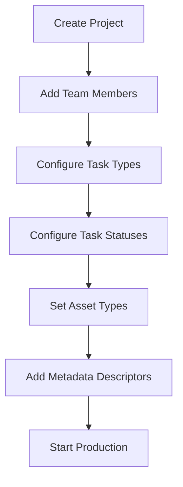

## Introduction

The Projects API provides endpoints for managing production projects in Zou/Kitsu. Projects are the top-level organizational unit that contain all production data including assets, shots, tasks, team members, and configuration settings.

## What are Projects?

In Zou/Kitsu, a **Project** (also called a Production) represents a single animation, VFX, or creative production. Each project has its own team, assets, shots, tasks, schedules, and settings that are isolated from other projects.

### Key Concepts

<CardGroup cols={2}>
  <Card title="Project Status" icon="circle-check">
    Projects can be Open, Closed, or have custom statuses to track production phases
  </Card>
  <Card title="Production Team" icon="users">
    A list of people assigned to work on the project with specific roles and permissions
  </Card>
  <Card title="Project Settings" icon="gear">
    Configurable options including task types, task statuses, asset types, and metadata descriptors
  </Card>
  <Card title="Production Type" icon="film">
    Classification of project as short film, feature, TV show, commercial, etc.
  </Card>
</CardGroup>

## Project Model

Projects include the following key properties:

<ResponseField name="id" type="string" required>
  Unique identifier (UUID format)
</ResponseField>

<ResponseField name="name" type="string" required>
  Project name (must be unique)
</ResponseField>

<ResponseField name="code" type="string">
  Short code or abbreviation for the project
</ResponseField>

<ResponseField name="description" type="string">
  Detailed description of the project
</ResponseField>

<ResponseField name="project_status_id" type="string" required>
  ID of the project status (Open, Closed, etc.)
</ResponseField>

<ResponseField name="production_type" type="string">
  Type of production: "short", "featurefilm", "tvshow", "commercial", etc.
</ResponseField>

<ResponseField name="production_style" type="string">
  Visual style: "2d", "3d", "2d3d", "vfx", "stop-motion", "motion-design", etc.
</ResponseField>

<ResponseField name="fps" type="string">
  Frames per second (default: "25")
</ResponseField>

<ResponseField name="ratio" type="string">
  Aspect ratio (default: "16:9")
</ResponseField>

<ResponseField name="resolution" type="string">
  Video resolution (default: "1920x1080")
</ResponseField>

<ResponseField name="start_date" type="string">
  Production start date (ISO 8601 format)
</ResponseField>

<ResponseField name="end_date" type="string">
  Production end date (ISO 8601 format)
</ResponseField>

<ResponseField name="man_days" type="integer">
  Estimated person-days for the project
</ResponseField>

<ResponseField name="nb_episodes" type="integer">
  Number of episodes (for TV shows)
</ResponseField>

<ResponseField name="episode_span" type="integer">
  Episode span for TV show scheduling
</ResponseField>

<ResponseField name="max_retakes" type="integer">
  Maximum number of allowed retakes
</ResponseField>

<ResponseField name="homepage" type="string">
  Default homepage view: "assets", "shots", "sequences", etc.
</ResponseField>

<ResponseField name="is_clients_isolated" type="boolean">
  Whether clients can only see their own comments and files
</ResponseField>

<ResponseField name="is_preview_download_allowed" type="boolean">
  Whether preview files can be downloaded
</ResponseField>

<ResponseField name="is_set_preview_automated" type="boolean">
  Whether setting preview files is automated
</ResponseField>

<ResponseField name="is_publish_default_for_artists" type="boolean">
  Whether publish is the default action for artists
</ResponseField>

<ResponseField name="has_avatar" type="boolean">
  Whether the project has a custom avatar/thumbnail
</ResponseField>

<ResponseField name="file_tree" type="object">
  Custom file tree configuration (JSONB)
</ResponseField>

<ResponseField name="data" type="object">
  Additional custom project data (JSONB)
</ResponseField>

<ResponseField name="team" type="array">
  Array of person IDs assigned to the project team
</ResponseField>

<ResponseField name="asset_types" type="array">
  Array of asset type IDs enabled for this project
</ResponseField>

<ResponseField name="task_types" type="array">
  Array of task type IDs with their priorities
</ResponseField>

<ResponseField name="task_statuses" type="array">
  Array of task status IDs with their priorities and board visibility
</ResponseField>

<ResponseField name="created_at" type="string">
  Creation timestamp (ISO 8601 format)
</ResponseField>

<ResponseField name="updated_at" type="string">
  Last update timestamp (ISO 8601 format)
</ResponseField>

## Production Styles

Projects can be classified by production style:

- **2d**: 2D Animation
- **2dpaper**: 2D Animation (Paper)
- **3d**: 3D Animation
- **2d3d**: 2D/3D Animation
- **ar**: Augmented Reality
- **vfx**: VFX
- **stop-motion**: Stop Motion
- **motion-design**: Motion Design
- **archviz**: Archviz
- **commercial**: Commercial
- **catalog**: Catalog
- **immersive**: Immersive Experience
- **nft**: NFT Collection
- **video-game**: Video Game
- **vr**: Virtual Reality

## Project Configuration

### Team Management

Projects have a team of people who can access and work on the project. Team membership is managed through:

- Adding team members (persons)
- Removing team members
- Department-based team grouping

### Task Types & Statuses

Each project can configure which task types and task statuses are available:

- **Task Types**: Define the kinds of work (Modeling, Animation, Compositing, etc.)
- **Task Statuses**: Define workflow states (Todo, WIP, Waiting for Approval, Done, etc.)
- **Priority**: Order in which task types/statuses appear in the UI

### Asset Types

Projects configure which asset types are available (Character, Prop, Environment, etc.). This determines what kinds of assets can be created in the project.

### Metadata Descriptors

Custom fields that extend entity data:

- **Entity Type**: Asset, Shot, Edit, Episode, or Sequence
- **Field Name**: Name of the custom field
- **Data Type**: string, number, boolean, list, checklist, tags, etc.
- **Choices**: For list/dropdown fields
- **For Client**: Whether the field is visible to clients
- **Departments**: Which departments can see/edit the field

## Budget Management

Projects can have budgets to track production costs:

- **Budgets**: Named budget sheets with currency
- **Budget Entries**: Individual line items with department, person, salary, duration
- **Time Tracking**: Integration with time spent data

## Schedule Management

Projects support sophisticated scheduling:

- **Milestones**: Key production dates and deliverables
- **Schedule Items**: Task assignments with dates
- **Schedule Versions**: Snapshot and compare different scheduling scenarios
- **Task Links**: Dependencies between tasks
- **Day Offs**: Team member vacations and holidays

## Status Automations

Projects can configure automated status transitions based on task completion and dependencies.

## Common Workflows

### Creating a Project

1. Create the project with basic information (name, type, dates)
2. Configure project settings (FPS, resolution, ratio)
3. Add team members
4. Set up task types and statuses
5. Configure asset types
6. Add metadata descriptors for custom fields
7. Set project to Open status

### Project Configuration

### Managing Project Settings

1. Access project settings endpoints
2. Add/remove task types with priorities
3. Add/remove task statuses
4. Configure asset types for the project
5. Set up status automations
6. Configure preview background files

## Permissions

Project operations require different permission levels:

- **View open projects**: Any authenticated user
- **View all projects**: Manager or Admin
- **Create projects**: Admin
- **Update project settings**: Manager on project
- **Delete projects**: Admin
- **Manage team**: Manager on project
- **View budgets**: Manager on project
- **View schedules**: Project member (not vendor/client)

## Project Statuses

Projects have lifecycle statuses:

- **Open/Active**: Currently in production
- **Closed**: Completed or archived
- **Custom Statuses**: Organizations can define their own

Open projects are the default view in most endpoints to focus on active work.

## Filtering Projects

Most project endpoints support filtering by:

- **name**: Filter by project name
- **project_status**: Filter by status (open/closed)

The API provides two main project list endpoints:

- **/data/projects/open**: Only open/active projects (most common)
- **/data/projects/all**: All projects regardless of status (requires manager+)

## Next Steps

<CardGroup cols={1}>
  <Card title="API Endpoints" icon="code" href="./endpoints">
    Explore all available project endpoints with detailed request/response examples
  </Card>
</CardGroup>
