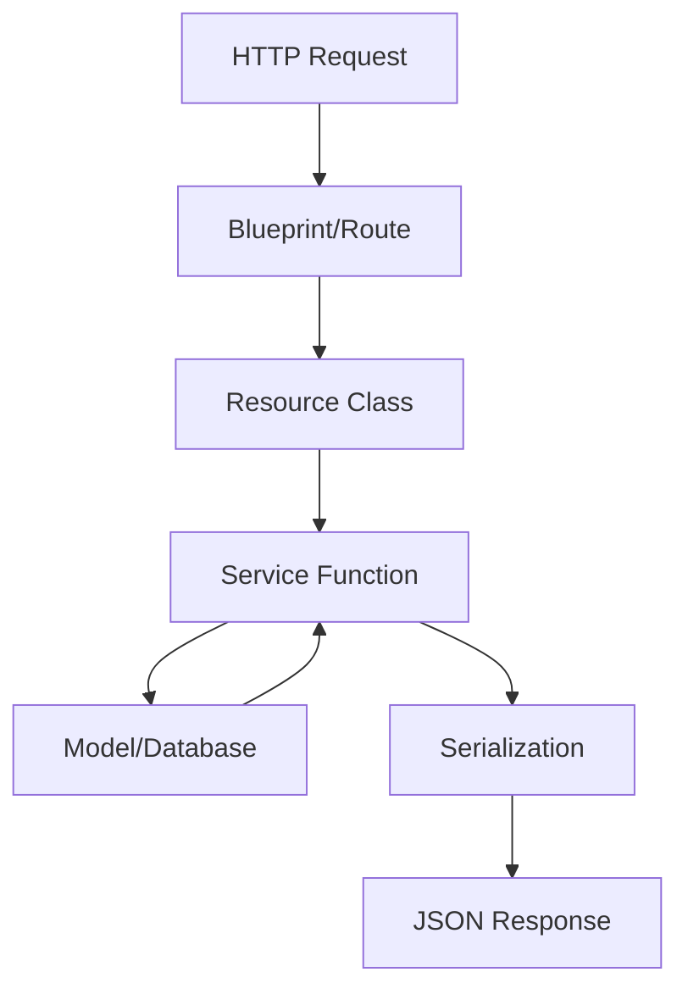

## Overview

Zou is built on Flask, a lightweight Python web framework, and follows a modular architecture that separates concerns into blueprints (routing), services (business logic), and models (data layer).

## Core Components

### Flask Application

The main application is initialized in `zou/app/__init__.py` and configured with:

- **Flask-SQLAlchemy** - Database ORM for PostgreSQL
- **Flask-JWT-Extended** - JWT token authentication
- **Flask-Principal** - Role-based permissions
- **Flask-Migrate** - Database schema migrations
- **Flask-Mail** - Email notifications
- **Flasgger** - OpenAPI/Swagger documentation

```python zou/app/__init__.py
app = Flask(__name__)
app.config.from_object(config)

db = SQLAlchemy(app)
migrate = Migrate(app, db)
jwt = JWTManager(app)
Principal(app)
mail = Mail()
mail.init_app(app)
```

### Configuration

The application configuration is environment-driven through `zou/app/config.py`, supporting:

- Authentication strategies (local, LDAP, SAML)
- Database connection pooling
- JWT token expiration
- File storage backends (local, S3, Swift)
- Email settings
- Search indexer (Meilisearch)
- Two-factor authentication enforcement

<Accordion title="Key Configuration Options">
```python
AUTH_STRATEGY = "auth_local_classic"  # or auth_remote_ldap, auth_local_no_password
JWT_ACCESS_TOKEN_EXPIRES = timedelta(days=7)
JWT_REFRESH_TOKEN_EXPIRES = timedelta(days=15)

DATABASE = {
    "drivername": "postgresql+psycopg",
    "host": "localhost",
    "port": "5432",
    "username": "postgres",
    "password": "mysecretpassword",
    "database": "zoudb",
}

FS_BACKEND = "local"  # or "s3", "swift"
ENFORCE_2FA = False  # Require 2FA for all users
```
</Accordion>

## Blueprint Architecture

Zou uses Flask blueprints to organize routes into logical modules. Each blueprint handles a specific domain:

### Blueprint Structure

```
zou/app/blueprints/
├── auth/          # Authentication & user session management
├── assets/        # Asset entity operations
├── shots/         # Shot entity operations
├── tasks/         # Task management
├── persons/       # User/person management
├── projects/      # Project operations
├── comments/      # Comments and reviews
├── files/         # File uploads and previews
├── playlists/     # Playlist management
├── events/        # Event streaming
├── crud/          # Generic CRUD operations
└── ...
```

### Blueprint Registration

All blueprints are registered in `zou/app/api.py`:

```python zou/app/api.py
def configure_api_routes(app):
    app.register_blueprint(auth_blueprint)
    app.register_blueprint(assets_blueprint)
    app.register_blueprint(breakdown_blueprint)
    app.register_blueprint(chats_blueprint)
    app.register_blueprint(comments_blueprint)
    app.register_blueprint(crud_blueprint)
    # ... more blueprints
```

### Example Blueprint

Each blueprint defines routes and maps them to resource classes:

```python zou/app/blueprints/auth/__init__.py
from flask import Blueprint

routes = [
    ("/auth/login", LoginResource),
    ("/auth/logout", LogoutResource),
    ("/auth/authenticated", AuthenticatedResource),
    ("/auth/refresh-token", RefreshTokenResource),
    ("/auth/totp", TOTPResource),
]

blueprint = Blueprint("auth", "auth")
api = configure_api_from_blueprint(blueprint, routes)
```

## Service Layer

The service layer contains all business logic and sits between blueprints (controllers) and models (data layer).

### Service Organization

```
zou/app/services/
├── auth_service.py           # Authentication logic
├── persons_service.py        # User management
├── projects_service.py       # Project operations
├── assets_service.py         # Asset operations
├── shots_service.py          # Shot operations
├── tasks_service.py          # Task management
├── files_service.py          # File handling
├── comments_service.py       # Comments and feedback
├── notifications_service.py  # Notification system
├── emails_service.py         # Email sending
└── ...
```

### Service Pattern

Services provide reusable business logic functions:

```python
# Example from base_service.py
def get_instance(model, instance_id, exception):
    """
    Get instance of any model from its ID and raise given exception if not found.
    """
    if instance_id is None:
        raise exception()
    
    try:
        instance = model.get(instance_id)
    except StatementError:
        raise exception()
    
    if instance is None:
        raise exception()
    
    return instance
```

<Note>
Services are stateless and focus on business logic. They handle:
- Data validation and transformation
- Permission checks
- Event emission
- Cache management
- External API calls
</Note>

## Data Flow



### Request Lifecycle

1. **HTTP Request** arrives at a blueprint route
2. **Route** dispatches to a Resource class method (GET, POST, PUT, DELETE)
3. **Resource** validates input and calls service functions
4. **Service** performs business logic and database operations
5. **Model** interacts with PostgreSQL via SQLAlchemy
6. **Response** is serialized and returned as JSON

## Database Layer

### Base Model

All models inherit from `BaseMixin` which provides:

- UUID primary keys
- Audit timestamps (created_at, updated_at)
- Common query methods (get, get_by, get_all)
- CRUD operations (create, update, delete)
- Serialization support

```python zou/app/models/base.py
class BaseMixin(object):
    id = db.Column(UUIDType(binary=False), primary_key=True, default=fields.gen_uuid)
    created_at = db.Column(db.DateTime, default=date_helpers.get_utc_now_datetime)
    updated_at = db.Column(db.DateTime, default=date_helpers.get_utc_now_datetime,
                          onupdate=date_helpers.get_utc_now_datetime)
    
    @classmethod
    def get(cls, id):
        return db.session.get(cls, id)
    
    @classmethod
    def create(cls, **kw):
        instance = cls(**kw)
        db.session.add(instance)
        db.session.commit()
        return instance
```

### Connection Pooling

Zou uses SQLAlchemy's connection pooling for performance:

```python
SQLALCHEMY_ENGINE_OPTIONS = {
    "pool_size": 30,           # Max persistent connections
    "max_overflow": 60,        # Additional connections when pool exhausted
    "pool_pre_ping": True,     # Verify connections before use
    "pool_recycle": 3600,      # Recycle connections after 1 hour
    "pool_reset_on_return": "commit",  # Clean up transaction state
}
```

## Caching Strategy

Zou uses Redis for caching frequently accessed data:

- **Memoization** - Function result caching with TTL
- **Auth tokens** - JWT token blacklist for logout
- **User data** - Current user profile caching
- **Project data** - Active project information

```python
from zou.app.utils import cache

@cache.cache.memoize(120)  # Cache for 2 minutes
def get_project(project_id):
    return Project.get(project_id).serialize()
```

## Event System

Zou emits events for major operations, allowing plugins and external systems to react:

```python
from zou.app.utils import events

events.emit(
    "task:status-changed",
    {"task_id": task.id, "new_status_id": status.id},
    project_id=task.project_id
)
```

<Info>
Events are processed asynchronously and can trigger:
- Email notifications
- Slack/Discord messages
- Webhook calls to external systems
- Status automations
- Search index updates
</Info>

## Extensions & Integrations

### Search Indexing

Zou integrates with Meilisearch for full-text search:

```python
INDEXER = {
    "host": "localhost",
    "port": "7700",
    "protocol": "http",
    "key": os.getenv("INDEXER_KEY"),
}
```

### File Storage

Supports multiple storage backends:

- **Local filesystem** - Default for development
- **Amazon S3** - Scalable cloud storage
- **OpenStack Swift** - Object storage

### Authentication Providers

- **Local** - Built-in password authentication
- **LDAP/Active Directory** - Enterprise directory integration
- **SAML SSO** - Single sign-on support
- **Two-Factor Auth** - TOTP, Email OTP, FIDO2/WebAuthn

## Scalability Considerations

<Accordion title="Horizontal Scaling">
Zou can be scaled horizontally by:

1. **Load balancing** multiple Flask instances
2. **Shared Redis** for cache and sessions
3. **PostgreSQL read replicas** for read-heavy workloads
4. **CDN** for static file delivery
5. **Background workers** for async tasks (email, exports)
</Accordion>

<Accordion title="Performance Optimization">
- Database query optimization with indexes
- N+1 query prevention with eager loading
- Response caching with Redis
- Connection pooling for database
- Pagination for large result sets
- Thumbnail generation for preview files
</Accordion>

## Next Steps

<CardGroup cols={2}>
  <Card title="Data Model" icon="database" href="./data-model">
    Explore the core entities and their relationships
  </Card>
  <Card title="Authentication" icon="lock" href="./authentication">
    Learn about JWT tokens and auth strategies
  </Card>
  <Card title="Permissions" icon="shield" href="./permissions">
    Understand role-based access control
  </Card>
  <Card title="API Reference" icon="code" href="/api-reference">
    Browse the complete API documentation
  </Card>
</CardGroup>