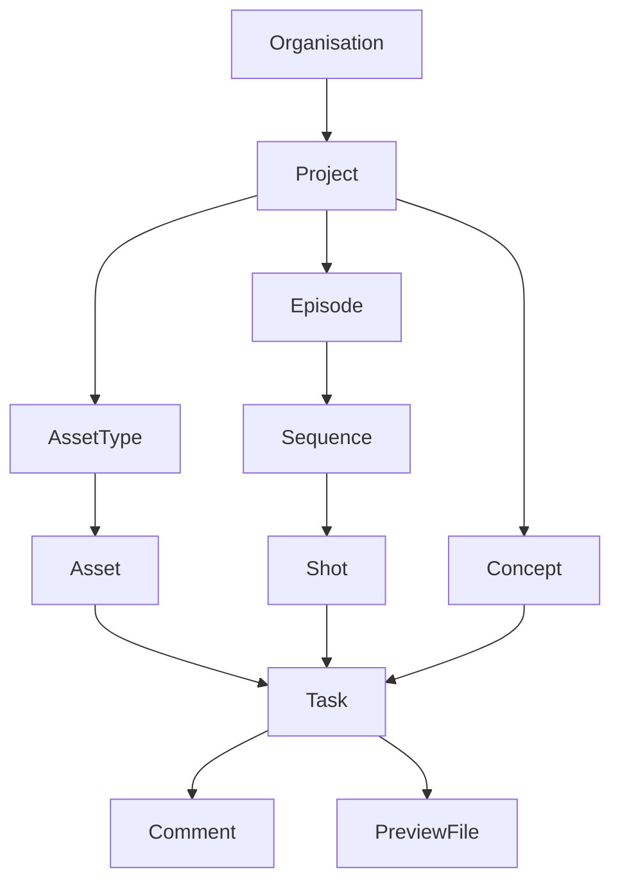
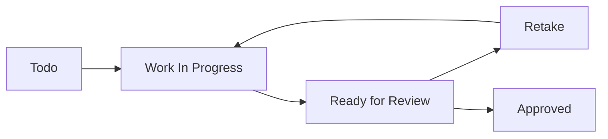
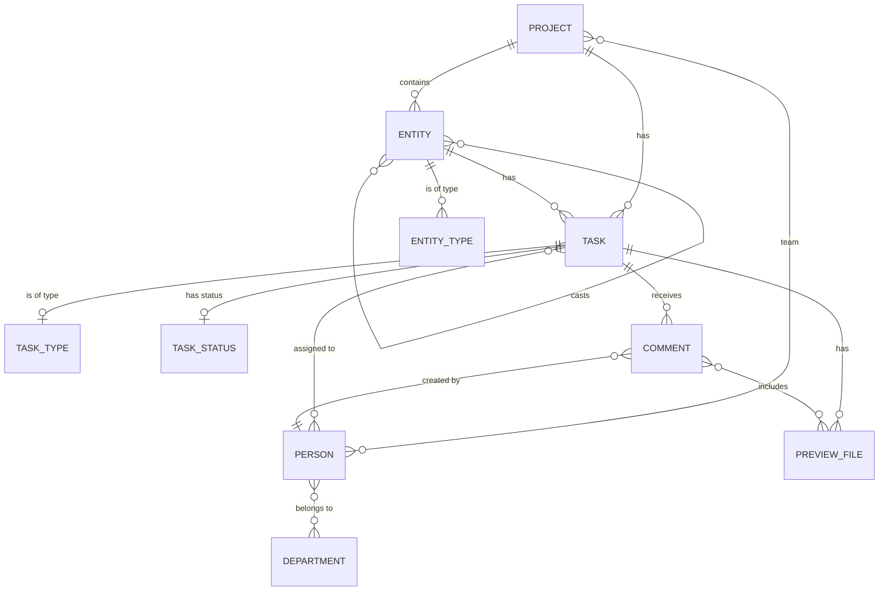

## Overview

Zou's data model is designed around the needs of animation and VFX production pipelines. The schema supports projects, assets, shots, tasks, and the people working on them.

## Core Entities

### Entity Hierarchy



## Project

A Project represents a production (film, series, commercial, game, etc.).

### Model Definition

```python zou/app/models/project.py
class Project(db.Model, BaseMixin, SerializerMixin):
    name = db.Column(db.String(80), nullable=False, unique=True, index=True)
    code = db.Column(db.String(80))
    description = db.Column(db.Text())
    
    # Production details
    production_type = db.Column(db.String(20), default="short")
    production_style = db.Column(ChoiceType(PROJECT_STYLES), default="2d3d")
    
    # Technical specs
    fps = db.Column(db.String(10), default="25")
    ratio = db.Column(db.String(10), default="16:9")
    resolution = db.Column(db.String(12), default="1920x1080")
    
    # Schedule
    start_date = db.Column(db.Date())
    end_date = db.Column(db.Date())
    
    # Relationships
    project_status_id = db.Column(UUIDType(binary=False), db.ForeignKey("project_status.id"))
    team = db.relationship("Person", secondary=ProjectPersonLink.__table__)
    asset_types = db.relationship("EntityType", secondary=ProjectAssetTypeLink.__table__)
    task_types = db.relationship("TaskType", secondary=ProjectTaskTypeLink.__table__)
    task_statuses = db.relationship("TaskStatus", secondary=ProjectTaskStatusLink.__table__)
```

### Key Fields

| Field | Type | Description |
|-------|------|-------------|
| `name` | String | Project display name (unique) |
| `code` | String | Short code for file paths |
| `production_style` | Choice | 2D, 3D, VFX, stop-motion, etc. |
| `fps` | String | Frames per second (e.g., "24", "25", "30") |
| `ratio` | String | Aspect ratio (e.g., "16:9", "2.39:1") |
| `resolution` | String | Video resolution (e.g., "1920x1080", "4096x2160") |
| `file_tree` | JSON | File naming convention template |
| `has_avatar` | Boolean | Whether project has uploaded logo |
| `is_clients_isolated` | Boolean | Client-only isolated access mode |

<Accordion title="Production Styles">
Supported production styles:
- `2d` - 2D Animation
- `3d` - 3D Animation
- `2d3d` - 2D/3D Animation (hybrid)
- `vfx` - Visual Effects
- `stop-motion` - Stop Motion
- `motion-design` - Motion Design
- `archviz` - Architectural Visualization
- `video-game` - Video Game
- `vr` - Virtual Reality
- `ar` - Augmented Reality
</Accordion>

## Entity

Entity is the base model for Assets, Shots, Sequences, Episodes, and Concepts. They share common behavior toward tasks and files.

### Model Definition

```python zou/app/models/entity.py
class Entity(db.Model, BaseMixin, SerializerMixin):
    name = db.Column(db.String(160), nullable=False)
    code = db.Column(db.String(160))  # Sanitized version of name
    description = db.Column(db.Text())
    
    # Status
    status = db.Column(ChoiceType(ENTITY_STATUSES), default="running")
    canceled = db.Column(db.Boolean, default=False)
    
    # Relationships
    project_id = db.Column(UUIDType(binary=False), db.ForeignKey("project.id"), nullable=False)
    entity_type_id = db.Column(UUIDType(binary=False), db.ForeignKey("entity_type.id"), nullable=False)
    parent_id = db.Column(UUIDType(binary=False), db.ForeignKey("entity.id"))  # For hierarchy
    
    # Shot-specific
    nb_frames = db.Column(db.Integer)  # Shot duration in frames
    
    # Casting/breakdown
    nb_entities_out = db.Column(db.Integer, default=0)  # Number of linked entities
    entities_out = db.relationship("Entity", secondary=EntityLink.__table__)
    
    # Preview
    preview_file_id = db.Column(UUIDType(binary=False), db.ForeignKey("preview_file.id"))
    data = db.Column(JSONB)  # Custom metadata
```

### Entity Types

| Type | Description | Has Parent | Typical Use |
|------|-------------|------------|-------------|
| **Episode** | Season episode | None | TV series |
| **Sequence** | Group of shots | Episode | Organizing shots |
| **Shot** | Individual shot | Sequence | Animation unit |
| **Asset** | Reusable element | None | Characters, props, sets |
| **Concept** | Design/artwork | None | Pre-production art |
| **Scene** | Scene grouping | Episode | Alternative to sequence |
| **Edit** | Edited sequence | None | Editorial/animatic |

### Entity Status

```python
ENTITY_STATUSES = [
    ("standby", "Stand By"),    # Not started
    ("running", "Running"),      # In progress
    ("complete", "Complete"),    # Finished
    ("canceled", "Canceled"),    # Won't be completed
]
```

### Entity Links (Casting)

The `EntityLink` model represents asset casting in shots:

```python
class EntityLink(db.Model, BaseMixin, SerializerMixin):
    entity_in_id = db.Column(UUIDType(binary=False), db.ForeignKey("entity.id"))  # Shot
    entity_out_id = db.Column(UUIDType(binary=False), db.ForeignKey("entity.id"))  # Asset
    nb_occurences = db.Column(db.Integer, default=1)
    label = db.Column(db.String(80), default="")
```

<Info>
**Example**: A shot `SH01` might cast assets `CharacterA` (2 occurrences) and `PropB` (1 occurrence).
</Info>

## Task

Tasks represent work assignments on entities (assets, shots, etc.).

### Model Definition

```python zou/app/models/task.py
class Task(db.Model, BaseMixin, SerializerMixin):
    name = db.Column(db.String(80), nullable=False)
    description = db.Column(db.Text())
    
    # Assignment
    assignees = db.relationship("Person", secondary=TaskPersonLink.__table__)
    assigner_id = db.Column(UUIDType(binary=False), db.ForeignKey("person.id"))
    
    # Progress tracking
    priority = db.Column(db.Integer, default=0)
    difficulty = db.Column(db.Integer, default=3)  # 1-5 scale
    duration = db.Column(db.Float, default=0)  # Actual time spent (days)
    estimation = db.Column(db.Float, default=0)  # Estimated time (days)
    completion_rate = db.Column(db.Integer, default=0)  # 0-100%
    retake_count = db.Column(db.Integer, default=0)
    
    # Dates
    start_date = db.Column(db.DateTime)
    due_date = db.Column(db.DateTime)
    real_start_date = db.Column(db.DateTime)  # When work actually started
    end_date = db.Column(db.DateTime)
    last_comment_date = db.Column(db.DateTime)
    
    # Relationships
    project_id = db.Column(UUIDType(binary=False), db.ForeignKey("project.id"))
    task_type_id = db.Column(UUIDType(binary=False), db.ForeignKey("task_type.id"))
    task_status_id = db.Column(UUIDType(binary=False), db.ForeignKey("task_status.id"))
    entity_id = db.Column(UUIDType(binary=False), db.ForeignKey("entity.id"))
    
    data = db.Column(JSONB)  # Custom metadata
```

### Task Types

Common task types in animation pipelines:

- **Modeling** - 3D model creation
- **Rigging** - Character setup for animation
- **Shading** - Material and texture application
- **Animation** - Character/object animation
- **FX** - Effects simulation
- **Lighting** - Scene lighting setup
- **Rendering** - Final image generation
- **Compositing** - Final image assembly
- **Layout** - Camera and staging
- **Storyboard** - Visual planning
- **Concept** - Design artwork

### Task Status

Typical task status workflow:



Each project can customize its task statuses and colors.

## Person

Person represents a user, artist, or team member.

### Model Definition

```python zou/app/models/person.py
class Person(db.Model, BaseMixin, SerializerMixin):
    first_name = db.Column(db.String(80), nullable=False)
    last_name = db.Column(db.String(80), nullable=False)
    email = db.Column(EmailType)
    phone = db.Column(db.String(30))
    
    # Role and permissions
    role = db.Column(ChoiceType(ROLE_TYPES), default="user")  # admin, manager, user, etc.
    position = db.Column(ChoiceType(POSITION_TYPES), default="artist")  # supervisor, lead, artist
    seniority = db.Column(ChoiceType(SENIORITY_TYPES), default="mid")  # senior, mid, junior
    departments = db.relationship("Department", secondary=DepartmentLink.__table__)
    
    # Account status
    active = db.Column(db.Boolean(), default=True)
    archived = db.Column(db.Boolean(), default=False)
    
    # Authentication
    password = db.Column(db.LargeBinary(60))  # BCrypt hash
    desktop_login = db.Column(db.String(80))  # Alternative login ID
    
    # Two-factor authentication
    totp_enabled = db.Column(db.Boolean(), default=False)
    email_otp_enabled = db.Column(db.Boolean(), default=False)
    fido_enabled = db.Column(db.Boolean(), default=False)
    
    # Preferences
    timezone = db.Column(TimezoneType(backend="pytz"))
    locale = db.Column(LocaleType)
    has_avatar = db.Column(db.Boolean(), default=False)
    
    # Notifications
    notifications_enabled = db.Column(db.Boolean(), default=False)
    notifications_slack_enabled = db.Column(db.Boolean(), default=False)
    notifications_discord_enabled = db.Column(db.Boolean(), default=False)
```

### User Roles

| Role | Description | Permissions |
|------|-------------|-------------|
| `admin` | Studio Manager | Full system access, user management |
| `manager` | Production Manager | Project management, team oversight |
| `supervisor` | Department Supervisor | Task review, department team management |
| `user` | Artist | Work on assigned tasks |
| `client` | External Client | View project progress (limited) |
| `vendor` | External Vendor | Work on outsourced tasks |

## Comments & Reviews

Comments are feedback on tasks, including text, attachments, and status changes.

```python
class Comment(db.Model, BaseMixin, SerializerMixin):
    text = db.Column(db.Text())
    checklist = db.Column(JSONB)  # Review checklist items
    data = db.Column(JSONB)  # Annotations, mentions
    
    task_id = db.Column(UUIDType(binary=False), db.ForeignKey("task.id"))
    person_id = db.Column(UUIDType(binary=False), db.ForeignKey("person.id"))
    task_status_id = db.Column(UUIDType(binary=False), db.ForeignKey("task_status.id"))
    
    # Preview files attached to this comment
    previews = db.relationship("PreviewFile", secondary=CommentPreviewLink.__table__)
```

## Preview Files

PreviewFile stores uploaded images/videos for tasks.

```python
class PreviewFile(db.Model, BaseMixin, SerializerMixin):
    name = db.Column(db.String(250))
    revision = db.Column(db.Integer, default=1)
    position = db.Column(db.Integer, default=1)
    extension = db.Column(db.String(6))
    
    task_id = db.Column(UUIDType(binary=False), db.ForeignKey("task.id"))
    person_id = db.Column(UUIDType(binary=False), db.ForeignKey("person.id"))
    
    # File info
    file_size = db.Column(db.Integer, default=0)
    width = db.Column(db.Integer)
    height = db.Column(db.Integer)
    duration = db.Column(db.Float)  # For videos
    
    # Status
    is_movie = db.Column(db.Boolean, default=False)
    status = db.Column(db.String(20), default="processing")
    validation_status = db.Column(db.String(20), default="neutral")
```

## Relationships Diagram



## Database Schema Conventions

### Primary Keys

All models use UUID primary keys (not auto-incrementing integers):

```python
id = db.Column(UUIDType(binary=False), primary_key=True, default=fields.gen_uuid)
```

<Note>
UUIDs provide:
- No ID collision in distributed systems
- Non-sequential IDs for security
- Easy data synchronization between instances
</Note>

### Audit Fields

Every model includes automatic timestamps:

```python
created_at = db.Column(db.DateTime, default=date_helpers.get_utc_now_datetime)
updated_at = db.Column(db.DateTime, default=date_helpers.get_utc_now_datetime,
                      onupdate=date_helpers.get_utc_now_datetime)
```

### JSON Fields

Flexible metadata storage using PostgreSQL JSONB:

```python
data = db.Column(JSONB)  # Indexed, queryable JSON
```

Example usage:
```python
# Store custom frame range in entity data
shot.data = {
    "frame_in": 1001,
    "frame_out": 1150,
    "fps": "24"
}
```

### Many-to-Many Relationships

Link tables connect entities:

```python
class ProjectPersonLink(db.Model):
    project_id = db.Column(UUIDType(binary=False), db.ForeignKey("project.id"), primary_key=True)
    person_id = db.Column(UUIDType(binary=False), db.ForeignKey("person.id"), primary_key=True)
```

## Querying Examples

### Get all shots in a sequence

```python
shots = Entity.query.filter_by(
    project_id=project_id,
    parent_id=sequence_id,
    entity_type_id=shot_type_id
).order_by(Entity.name).all()
```

### Get all tasks assigned to a person

```python
tasks = Task.query.join(
    Task.assignees
).filter(
    Person.id == person_id
).all()
```

### Get assets cast in a shot

```python
cast_assets = Entity.query.join(
    EntityLink,
    EntityLink.entity_out_id == Entity.id
).filter(
    EntityLink.entity_in_id == shot_id
).all()
```

## Next Steps

<CardGroup cols={2}>
  <Card title="Architecture" icon="sitemap" href="./architecture">
    Learn about the system architecture
  </Card>
  <Card title="Authentication" icon="key" href="./authentication">
    Understand the authentication system
  </Card>
  <Card title="API Reference" icon="code" href="/api-reference">
    Explore the REST API endpoints
  </Card>
  <Card title="Permissions" icon="shield" href="./permissions">
    Learn about access control
  </Card>
</CardGroup>