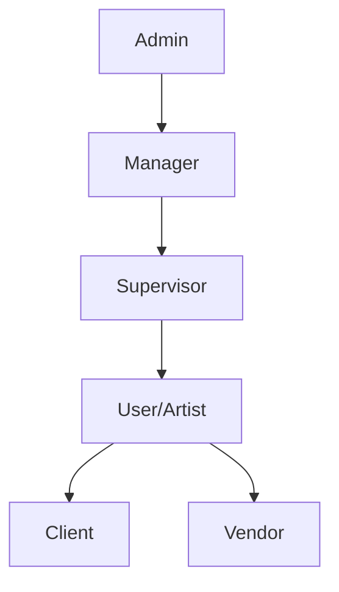

## Overview

Zou implements a role-based access control (RBAC) system using Flask-Principal. Users are assigned roles that determine their permissions across the system.

## User Roles

Zou defines six user roles with hierarchical permissions:

### Role Hierarchy



### Role Definitions

| Role | Code | Description | Typical Users |
|------|------|-------------|---------------|
| **Admin** | `admin` | Studio Manager | IT, Studio heads |
| **Manager** | `manager` | Production Manager | Producers, coordinators |
| **Supervisor** | `supervisor` | Department Lead | CG supervisors, leads |
| **User** | `user` | Artist | Modelers, animators, etc. |
| **Client** | `client` | External Reviewer | Clients, directors |
| **Vendor** | `vendor` | External Studio | Outsourcing partners |

### Role Configuration

```python zou/app/models/person.py
ROLE_TYPES = [
    ("user", "Artist"),
    ("admin", "Studio Manager"),
    ("supervisor", "Supervisor"),
    ("manager", "Production Manager"),
    ("client", "Client"),
    ("vendor", "Vendor"),
]

class Person(db.Model, BaseMixin, SerializerMixin):
    role = db.Column(ChoiceType(ROLE_TYPES), default="user", nullable=False)
```

## Permission Levels

### Admin Permissions

**Full system access** including:

- User management (create, edit, delete users)
- System configuration
- All project access
- Department management
- Studio-wide settings
- API key generation
- Billing and subscription management

```python
from zou.app.utils import permissions

if permissions.has_admin_permissions():
    # Perform admin-only action
    pass
```

### Manager Permissions

**Project and production management**:

- Create and configure projects
- Assign team members to projects
- View all tasks in assigned projects
- Edit task status and assignments
- Manage schedules and milestones
- Export reports
- Client access management

```python
if permissions.has_manager_permissions():
    # Manager or admin can perform this
    pass
```

<Note>
Managers have **project-scoped** access. They can only manage projects they're assigned to.
</Note>

### Supervisor Permissions

**Department-level oversight**:

- Review tasks in their department
- Approve/request retakes
- View team performance
- Assign tasks to department members
- Limited project configuration

```python
if permissions.has_supervisor_permissions():
    # Supervisor, manager, or admin
    pass
```

Supervisors see tasks filtered by **department**:

```python zou/app/services/user_service.py
def get_tasks_to_check():
    if permissions.has_supervisor_permissions():
        current_user = persons_service.get_current_user(relations=True)
        departments_ids = current_user["departments"]
        project_ids = [project["id"] for project in related_projects()]
        return tasks_service.get_person_tasks_to_check(
            project_ids, departments_ids
        )
```

### Artist/User Permissions

**Task-focused access**:

- View assigned tasks
- Update task status
- Upload preview files
- Add comments
- View related entities (assets/shots)
- Limited to assigned projects

```python
if permissions.has_artist_permissions():
    # Any authenticated user
    pass
```

### Client Permissions

**Review-only access**:

- View project progress
- Watch preview videos
- Add review comments
- Approve/reject work
- **No** editing capabilities
- Isolated view (can't see other clients' projects)

```python
if permissions.has_client_permissions():
    # Client-specific logic
    pass
```

<Info>
Clients have **restricted** access. Enable `is_clients_isolated` on projects to prevent clients from seeing each other.
</Info>

### Vendor Permissions

**Outsourced work access**:

- View assigned tasks only
- Upload deliverables
- Limited project visibility
- Cannot see internal tasks
- Time-limited access

## Permission Implementation

### Flask-Principal Integration

Zou uses Flask-Principal for permission management:

```python zou/app/utils/permissions.py
from flask_principal import RoleNeed, Permission

admin_permission = Permission(RoleNeed("admin"))
manager_permission = Permission(RoleNeed("manager"))
supervisor_permission = Permission(RoleNeed("supervisor"))
client_permission = Permission(RoleNeed("client"))
vendor_permission = Permission(RoleNeed("vendor"))
artist_permission = Permission(RoleNeed("user"))
```

### Permission Checks

#### Function-based

```python
def has_admin_permissions():
    return admin_permission.can()

def has_manager_permissions():
    return admin_permission.can() or manager_permission.can()

def has_at_least_supervisor_permissions():
    return (
        supervisor_permission.can()
        or admin_permission.can()
        or manager_permission.can()
    )
```

#### Exception-based

```python
def check_admin_permissions():
    if admin_permission.can():
        return True
    else:
        raise PermissionDenied
```

### Permission Decorators

Protect routes with decorators:

```python
from zou.app.utils.permissions import require_admin, require_manager

@require_admin
def delete_user(user_id):
    # Only admins can execute this
    pass

@require_manager
def create_project(project_data):
    # Admins and managers can execute this
    pass
```

## Identity Loading

User roles are loaded into the identity when JWT token is validated:

```python zou/app/__init__.py
@identity_loaded.connect_via(app)
def on_identity_loaded(_, identity):
    identity.user = persons_service.get_person_raw_cached(identity.id)
    
    # Add role-based permissions
    if identity.user.role == "admin":
        identity.provides.add(RoleNeed("admin"))
        identity.provides.add(RoleNeed("manager"))  # Admins inherit manager
    
    if identity.user.role == "manager":
        identity.provides.add(RoleNeed("manager"))
    
    if identity.user.role == "supervisor":
        identity.provides.add(RoleNeed("supervisor"))
    
    if identity.user.role == "client":
        identity.provides.add(RoleNeed("client"))
    
    if identity.user.role == "vendor":
        identity.provides.add(RoleNeed("vendor"))
    
    # Add identity type (person, bot, person_api)
    identity.provides.add(RoleNeed(identity.auth_type))
```

## Project-Level Permissions

### Team Membership

Users must be **assigned to a project** to access it:

```python zou/app/models/project.py
class Project(db.Model):
    team = db.relationship("Person", secondary=ProjectPersonLink.__table__)
```

Check team membership:

```python
def build_team_filter():
    """Query filter for models from projects where user is team member."""
    current_user = persons_service.get_current_user_raw()
    return Project.team.contains(current_user)
```

### Project Access Rules

| Role | Access Rule |
|------|-------------|
| **Admin** | All projects |
| **Manager** | Projects they're assigned to |
| **Supervisor** | Projects they're assigned to |
| **User** | Projects they're assigned to |
| **Client** | Projects they're assigned to (isolated) |
| **Vendor** | Projects they're assigned to (limited) |

### Client Isolation

Projects can isolate clients:

```python
class Project(db.Model):
    is_clients_isolated = db.Column(db.Boolean(), default=False)
```

When enabled:
- Clients only see their assigned tasks
- Cannot see other clients or team members
- Limited to review comments only

## Task-Level Permissions

### Task Assignment

Tasks have explicit assignees:

```python zou/app/models/task.py
class Task(db.Model):
    assignees = db.relationship("Person", secondary=TaskPersonLink.__table__)
    assigner_id = db.Column(UUIDType(binary=False), db.ForeignKey("person.id"))
```

### Task Access Rules

**Artists** can only access:
- Tasks explicitly assigned to them
- Tasks in projects they're team members of

**Supervisors** can access:
- All tasks in their department
- Tasks in assigned projects

**Managers** can access:
- All tasks in assigned projects

**Admins** can access:
- All tasks in all projects

### Task Query Filters

```python zou/app/services/user_service.py
def build_assignee_filter():
    """Query filter for tasks assigned to current user."""
    current_user = persons_service.get_current_user_raw()
    return Task.assignees.contains(current_user)

def get_todos():
    """Get all unfinished tasks assigned to current user."""
    current_user = persons_service.get_current_user()
    projects = related_projects()  # Only assigned projects
    return tasks_service.get_person_tasks(current_user["id"], projects)
```

## Department-Based Permissions

Users can belong to multiple departments:

```python zou/app/models/person.py
class Person(db.Model):
    departments = db.relationship(
        "Department", 
        secondary=DepartmentLink.__table__, 
        lazy="selectin"
    )
```

Common departments:
- **Modeling** - 3D modelers
- **Rigging** - Character TDs
- **Animation** - Animators
- **Lighting** - Lighting artists
- **FX** - Effects artists
- **Compositing** - Compositors

Supervisors see tasks filtered by their departments:

```python
def get_tasks_to_check():
    if permissions.has_supervisor_permissions():
        current_user = persons_service.get_current_user(relations=True)
        departments_ids = current_user["departments"]
        return tasks_service.get_person_tasks_to_check(
            project_ids, departments_ids
        )
```

## API Endpoint Protection

Endpoints are protected at the resource level:

```python
from flask_restful import Resource
from zou.app.utils.permissions import check_admin_permissions

class UserResource(Resource):
    @jwt_required()
    def post(self):
        check_admin_permissions()  # Only admins can create users
        # ... create user logic
```

### Common Patterns

<Accordion title="Admin-Only Endpoints">
```python
from zou.app.utils.permissions import check_admin_permissions

class DeleteUserResource(Resource):
    @jwt_required()
    def delete(self, user_id):
        check_admin_permissions()
        # Delete user logic
```
</Accordion>

<Accordion title="Manager+ Endpoints">
```python
from zou.app.utils.permissions import check_manager_permissions

class CreateProjectResource(Resource):
    @jwt_required()
    def post(self):
        check_manager_permissions()  # Managers and admins
        # Create project logic
```
</Accordion>

<Accordion title="Authenticated Endpoints">
```python
from flask_jwt_extended import jwt_required

class GetTasksResource(Resource):
    @jwt_required()  # Any authenticated user
    def get(self):
        # Get tasks for current user
        return user_service.get_todos()
```
</Accordion>

## Special Permissions

### Bot Accounts

Bots are service accounts with long-lived API tokens:

```python
class Person(db.Model):
    is_bot = db.Column(db.Boolean(), default=False)
    jti = db.Column(db.String(60), unique=True)  # Permanent token
```

Bots have custom permissions defined at creation.

### Person API Tokens

Users can generate personal API keys:

```python
identity_type = "person_api"  # In JWT payload
```

API tokens:
- Have same permissions as the user
- Can be revoked independently
- Don't expire with normal token rotation

## Protected Accounts

Certain accounts cannot be modified:

```bash
PROTECTED_ACCOUNTS=admin@studio.com;system@studio.com
```

Protected accounts:
- Cannot be deleted
- Cannot change role
- Cannot be deactivated

## Permission Caching

User data is cached in Redis to reduce database queries:

```python
@cache.cache.memoize(120)  # Cache for 2 minutes
def get_person_raw_cached(person_id):
    return Person.get(person_id)
```

Cache is cleared on:
- User role change
- Department assignment change
- Project team membership change

## Security Best Practices

<Accordion title="Principle of Least Privilege">
- Assign minimum necessary role
- Use supervisor role instead of manager when possible
- Regularly audit user permissions
- Remove users from projects when work is done
</Accordion>

<Accordion title="Client Security">
- Always enable `is_clients_isolated` for client projects
- Create separate client accounts (never share)
- Set expiration dates for temporary client access
- Review client permissions regularly
</Accordion>

<Accordion title="Vendor Security">
- Use vendor role for outsourced work
- Assign only specific tasks, not entire projects
- Set clear start/end dates
- Revoke access when contract ends
</Accordion>

## Permission Errors

When permission checks fail:

```python
class PermissionDenied(Forbidden):
    pass  # Returns HTTP 403
```

Example response:

```json
{
  "error": true,
  "message": "Permission denied"
}
```

## Testing Permissions

Check current user permissions:

```bash
curl http://localhost:5000/auth/authenticated \
  -H "Authorization: Bearer <token>"
```

Response includes role:

```json
{
  "authenticated": true,
  "user": {
    "id": "uuid",
    "email": "user@studio.com",
    "role": "user"
  }
}
```

## Next Steps

<CardGroup cols={2}>
  <Card title="Authentication" icon="key" href="./authentication">
    Learn about JWT authentication
  </Card>
  <Card title="User Management" icon="users" href="/api-reference/persons">
    Manage users and roles
  </Card>
  <Card title="Projects" icon="folder" href="/api-reference/projects">
    Configure project access
  </Card>
  <Card title="Tasks" icon="check-square" href="/api-reference/tasks">
    Assign and manage tasks
  </Card>
</CardGroup>